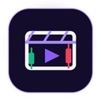

<p align="center">
  
</p>

<h1 align="center">TradeTools</h1>

<p align="center">
  Локальный desktop-помощник для трейдеров: автоматическая запись видео сделок, хранилище прокси/VPS и напоминания об оплате серверов.
</p>

<p align="center">
  <a href="https://github.com/JaysonFrost/TradeTools/actions/workflows/ci.yml"></a>
  <a href="https://github.com/JaysonFrost/TradeTools/releases"></a>
  <a href="LICENSE"></a>
</p>

## Скачать

Готовые сборки публикуются в [GitHub Releases](https://github.com/JaysonFrost/TradeTools/releases).

- **Windows:** скачайте `TradeTools-<version>-win-x64.exe`.
- **macOS:** скачайте `.dmg` или `.zip` с `mac` в названии.

Пока сборки не подписаны платным сертификатом разработчика, Windows SmartScreen и macOS Gatekeeper могут показать предупреждение. Скачивайте приложение только из раздела Releases этого репозитория и сверяйте `SHA256SUMS.txt`, если сомневаетесь.

После установки TradeTools сам проверяет новые версии при запуске. Если обновление найдено, приложение покажет плашку, предложит скачать новую версию и установит её после вашего подтверждения.

## Что умеет TradeTools

<table>
  <tr>
    <th align="left">Видео сделок</th>
    <th align="left">Прокси и VPS</th>
  </tr>
  <tr>
    <td valign="top">
      <ul>
        <li>Записывает клипы сделок через встроенную запись окна терминала без OBS.</li>
        <li>Оставляет <strong>OBS Replay Buffer</strong> как альтернативный режим для тех, кому он удобен.</li>
        <li>Автоматически видит сделки Vataga, TigerTrade и MetaScalp без API-ключей биржи.</li>
        <li>Vataga читается по локальным <code>.clef</code> логам, TigerTrade по <code>WorkLog</code>, MetaScalp по локальному read-only API терминала.</li>
        <li>Обрезает replay через встроенный <code>ffmpeg</code>.</li>
        <li>Кладёт готовый клип в выбранную папку.</li>
        <li>Показывает очередь клипов, предпросмотр и открытие файла.</li>
        <li>Позволяет переименовать видео прямо из приложения.</li>
        <li>Отправляет системное уведомление, когда клип готов.</li>
      </ul>
    </td>
    <td valign="top">
      <ul>
        <li>Хранит VPS/прокси: название, IP/домен, SSH-логин, пароль, день оплаты и ссылку на хостинг.</li>
        <li>Сохраняет SSH-пароли в системный keychain, а не в JSON-файл.</li>
        <li>Добавляет два сервера через <strong>Мастер настройки прокси</strong>.</li>
        <li>Связывает серверы в маршрут <code>первый -&gt; второй</code>.</li>
        <li>Автоматически настраивает Xray/VLESS через SSH.</li>
        <li>Поднимает локальный HTTP proxy для терминала: <code>127.0.0.1:1083</code> по умолчанию.</li>
        <li>Проверяет VPN/туннели и помогает обойти VPN для VPS, если пинг стал слишком высоким.</li>
        <li>Напоминает системными уведомлениями о сроках оплаты серверов.</li>
      </ul>
    </td>
  </tr>
</table>

Общее:

- Работает локально: без подписки, без Telegram/Discord-gate и без загрузки клипов в облако.
- Хранит чувствительные данные через системный keychain.
- Даёт отдельные мастеры настройки для видео и прокси, чтобы пользователь не смешивал два сценария.

## Быстрый старт

1. Откройте торговый терминал, окно которого нужно записывать.
2. Откройте TradeTools и перейдите в `Видео`.
3. Нажмите `Мастер настройки видео`.
4. На шаге источника записи выберите `Встроенная запись окна` и укажите окно терминала.
5. Выберите папку готовых клипов и сохраните отступы до/после сделки.
6. Нажмите `Создать тестовый клип`, чтобы проверить встроенный replay-буфер и ffmpeg-нарезку.
7. Перед торговлей оставьте TradeTools и нужный терминал открытыми: Vataga, TigerTrade или MetaScalp. После закрытия позиции клип будет создан автоматически.

OBS больше не обязателен. Если вам удобнее старый вариант, в настройках видео можно выбрать `OBS Replay Buffer`, включить OBS WebSocket и указать папку replay.

Подробная инструкция лежит в [desktop/docs/USER_GUIDE_RU.md](desktop/docs/USER_GUIDE_RU.md).

## Прокси и VPS

На странице `Прокси` можно открыть `Мастер настройки прокси`, добавить два сервера, сохранить связку и нажать `Настроить и запустить связку`. TradeTools подключится по SSH, установит Xray, свяжет серверы в маршрут и покажет, что указать в торговом терминале. Для трёх и более серверов используйте список `Порядок связки` на странице прокси.

Если на компьютере включён VPN, антизапрет или другой TUN-клиент, он может отправить подключение локального Xray к VPS через лишний VPN-выход. Это часто выглядит как резкий рост пинга, например вместо 130-140 мс получается 250-300 мс. В этом случае:

1. Нажмите `Проверить связку` и посмотрите блок `VPN и маршрут`.
2. На Windows нажмите `Обойти VPN для VPS`, подтвердите UAC и дождитесь результата по каждому VPS IP. TradeTools добавит persistent `/32` маршруты до серверов через обычный Wi-Fi/Ethernet gateway.
3. Перезапустите связку кнопкой `Настроить и запустить`, затем перезапустите торговый терминал.
4. Если ваш VPN поддерживает split tunneling, дополнительно исключите TradeTools и локальный Xray core из туннеля.

На macOS автоматическое добавление маршрутов пока не выполняется: используйте split tunneling в VPN-клиенте или добавьте host routes до VPS вручную.

Важно:

- используйте только свои VPS и свои доступы;
- SSH-пароли сохраняются в системный keychain;
- не отправляйте торговый терминал одновременно через несколько proxy/VPN; в терминале должен быть указан HTTP proxy TradeTools `127.0.0.1:1083` или выбранный локальный порт.

## Для разработчиков

Проект живёт в папке `desktop/`.

Требования:

- Node.js 22 LTS или новее;
- npm 10 или новее;
- OBS только для ручной проверки альтернативного OBS-режима.

Локальный запуск:

```bash
cd desktop
npm ci
npm run dev
```

Проверки:

```bash
cd desktop
npm run typecheck
npm test
npm run build
```

Сборка установщиков:

```bash
cd desktop
npm run dist:win
npm run dist:mac
```

Артефакты появятся в `desktop/dist/`.

## Релизы

Релизы собираются GitHub Actions из тегов:

```bash
git tag v0.1.0
git push origin v0.1.0
```

Workflow соберёт Windows/macOS, создаст GitHub Release и загрузит установщики, updater-файлы и `SHA256SUMS.txt`.

Подробный порядок выпуска: [desktop/docs/RELEASES_RU.md](desktop/docs/RELEASES_RU.md).

История изменений ведётся в [CHANGELOG.md](CHANGELOG.md).

## Безопасность и дисклеймер

TradeTools не является финансовым советником и не принимает торговых решений. Приложение помогает записывать сделки и управлять локальными инструментами вокруг торговли.

Не публикуйте в issues и pull requests:

- OBS WebSocket пароль, если используете OBS-режим;
- SSH-пароли;
- IP серверов, если не хотите раскрывать инфраструктуру;
- содержимое `settings.json` без ручной очистки.

## Лицензия

TradeTools распространяется по лицензии [MIT](LICENSE). Проект бесплатный и открыт для pull requests.

Часть сторонних компонентов распространяется по своим лицензиям. Особенно важно: bundled `ffmpeg-static` имеет лицензию `GPL-3.0-or-later`. Подробности: [THIRD_PARTY_NOTICES.md](THIRD_PARTY_NOTICES.md).

Вклад в проект: [CONTRIBUTING.md](CONTRIBUTING.md). Сообщения о безопасности: [SECURITY.md](SECURITY.md).
